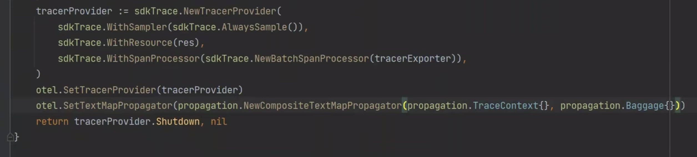
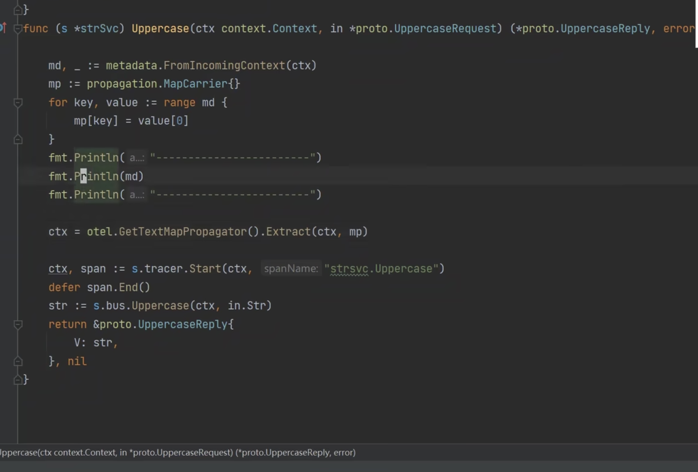

# otel 传播程序方式

## 参考案例

[https://github.com/q-meet/grpc-trace-opentelemetry-demo](https://github.com/q-meet/grpc-trace-opentelemetry-demo)

## 1. TraceContext 传播追踪信息，确保tracer的连续性

## 2. Baggage 传播用户自定义信息

server: 存储  

存储端需先声明：

```go
otel.SetTextMapPropagator(propagation.NewCompositeTextMapPropagator(propagation.TraceContext{}, propagation.Baggage{}))
```

微服务调用展示

client

```go

	otel.SetTextMapPropagator(propagation.NewCompositeTextMapPropagator(propagation.TraceContext{}, propagation.Baggage{}))


	var ctx = context.Background()
	ctx = context.WithValue(ctx, "xx", "xx1123")
	TraceState := trace.TraceState{}
	TraceState, _ = TraceState.Insert("foo", "bar")
	traceIdStr := generateTraceID(32)
	spanIDStr := generateTraceID(16)
	traceId, err := trace.TraceIDFromHex(traceIdStr)
	spanID, err := trace.SpanIDFromHex(spanIDStr)
	fmt.Println("----------------")
	fmt.Println("----------------traceIdStr:", traceIdStr, err)
	fmt.Println("----------------spanIDStr:", spanIDStr, err)
	fmt.Println("----------------")
	span := trace.SpanContextConfig{
		TraceID:    traceId,
		SpanID:     spanID,
		TraceFlags: 0x1,
		TraceState: TraceState,
		Remote:     true,
	}
	spanCtx := trace.NewSpanContext(span)

	ctx = trace.ContextWithRemoteSpanContext(ctx, spanCtx)

	md := propagation.MapCarrier{
		"xxx": "222",
	}
	otel.GetTextMapPropagator().Inject(ctx, md)
	ctx = metadata.NewOutgoingContext(ctx, metadata.New(md))

	// 调用 SayHello 方法
	res, err := c.SayHello(ctx, &hello.HelloRequest{Name: "Hello World"})

```

server 查看

```go
md, _ := metadata.FromIncomingContext(ctx)
	mp := propagation.MapCarrier{}
	for key, val := range md {
		mp[key] = val[0]
	}
	fmt.Println("---------------")
	fmt.Println(mp)
	fmt.Println("---------------")

	ctx = otel.GetTextMapPropagator().Extract(ctx, mp)
```


初始化时声明存储


server 链接

