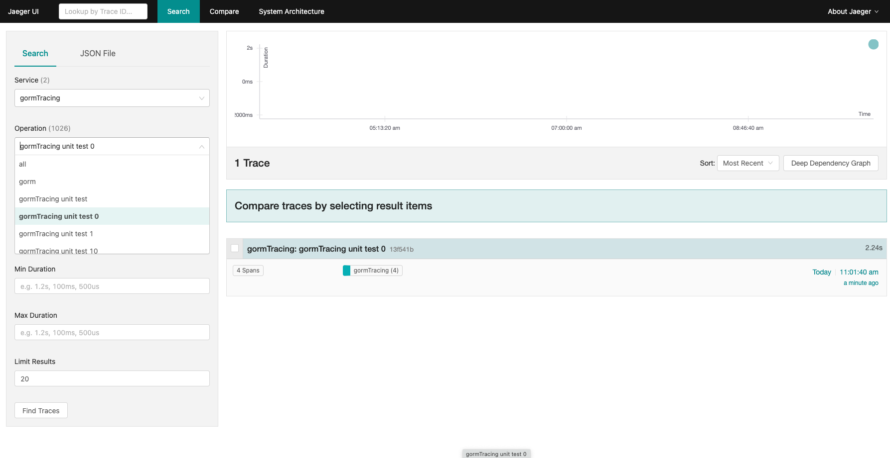
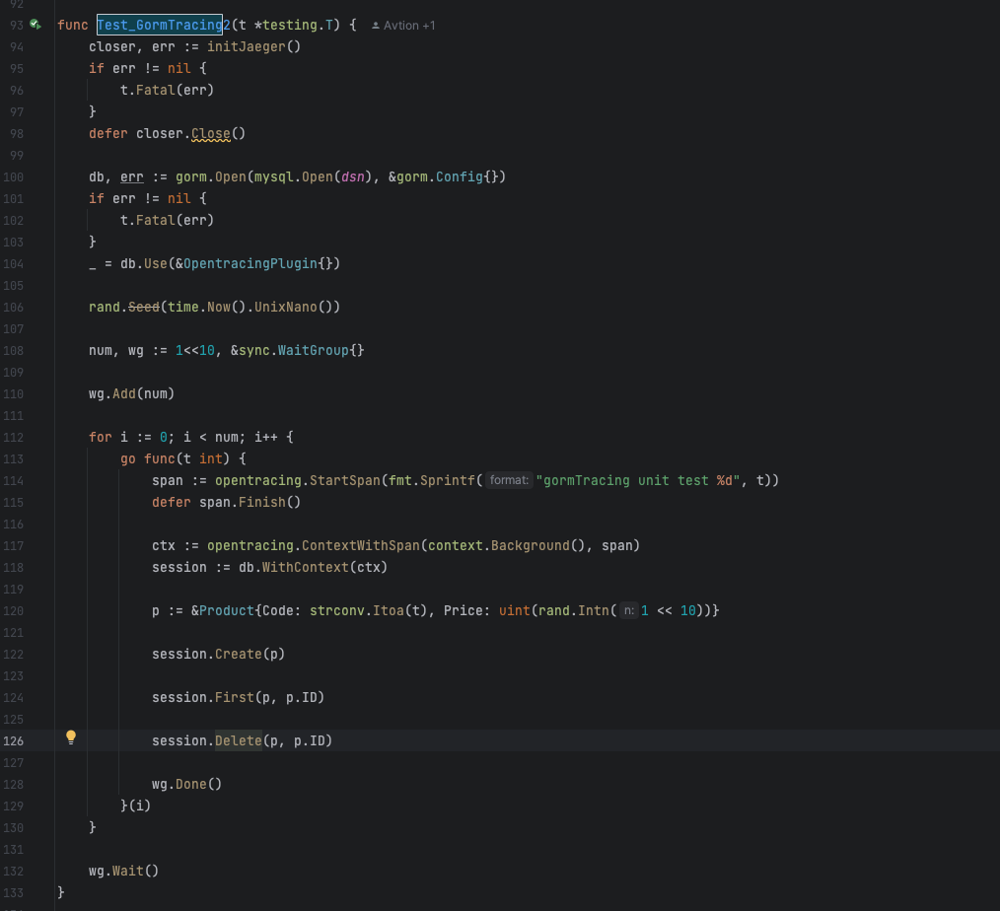

# go

## gormTracing Golang 上手GORM V2 + Opentracing链路追踪优化CRUD体验（源码阅读）

[https://github.com/avtion/gormTracing.git]( https://github.com/avtion/gormTracing.git )

实现效果





### Docker搭建Opentracing + jaeger all in one平台

注：Docker是最简单的，还有其他的方式，有兴趣的朋友可以去翻阅技术文档

**使用的镜像：`jaegertracing/all-in-one:1.18`**

Docker命令

```xshell
docker run -d --name jaeger -e COLLECTOR_ZIPKIN_HTTP_PORT=9411 -p 5775:5775/udp -p 6831:6831/udp -p 6832:6832/udp -p 5778:5778 -p 16686:16686 -p 14268:14268 -p 14250:14250 -p 9411:9411 jaegertracing/all-in-one:1.18
```

浏览器访问`localhost:16686`，可以看到`JaegerUI`界面，如下所示：


OpentracingPlugin file

```go
package gormTracing

import (
  "github.com/opentracing/opentracing-go"
  tracerLog "github.com/opentracing/opentracing-go/log"
  "gorm.io/gorm"
)

const (
  gormSpanKey        = "__gorm_span"
  callBackBeforeName = "opentracing:before"
  callBackAfterName  = "opentracing:after"
)

func before(db *gorm.DB) {
  // 先从父级spans生成子span
  span, _ := opentracing.StartSpanFromContext(db.Statement.Context, "gorm")
  // 利用db实例去传递span
  db.InstanceSet(gormSpanKey, span)
  return
}

func after(db *gorm.DB) {
  // 从GORM的DB实例中取出span
  _span, isExist := db.InstanceGet(gormSpanKey)
  if !isExist {
    return
  }

  // 断言进行类型转换
  span, ok := _span.(opentracing.Span)
  if !ok {
    return
  }
  defer span.Finish()

  // Error
  if db.Error != nil {
    span.LogFields(tracerLog.Error(db.Error))
  }

  // sql
  span.LogFields(tracerLog.String("sql", db.Dialector.Explain(db.Statement.SQL.String(), db.Statement.Vars...)))
  return
}

type OpentracingPlugin struct{}

func (op *OpentracingPlugin) Name() string {
  return "opentracingPlugin"
}

func (op *OpentracingPlugin) Initialize(db *gorm.DB) (err error) {
  // 开始前
  db.Callback().Create().Before("gorm:before_create").Register(callBackBeforeName, before)
  db.Callback().Query().Before("gorm:query").Register(callBackBeforeName, before)
  db.Callback().Delete().Before("gorm:before_delete").Register(callBackBeforeName, before)
  db.Callback().Update().Before("gorm:setup_reflect_value").Register(callBackBeforeName, before)
  db.Callback().Row().Before("gorm:row").Register(callBackBeforeName, before)
  db.Callback().Raw().Before("gorm:raw").Register(callBackBeforeName, before)

  // 结束后
  db.Callback().Create().After("gorm:after_create").Register(callBackAfterName, after)
  db.Callback().Query().After("gorm:after_query").Register(callBackAfterName, after)
  db.Callback().Delete().After("gorm:after_delete").Register(callBackAfterName, after)
  db.Callback().Update().After("gorm:after_update").Register(callBackAfterName, after)
  db.Callback().Row().After("gorm:row").Register(callBackAfterName, after)
  db.Callback().Raw().After("gorm:raw").Register(callBackAfterName, after)
  return
}

var _ gorm.Plugin = &OpentracingPlugin{}

```

test file

```go
package gormTracing

import (
  "context"
  "fmt"
  "github.com/opentracing/opentracing-go"
  "github.com/uber/jaeger-client-go"
  "github.com/uber/jaeger-client-go/config"
  "gorm.io/driver/mysql"
  "gorm.io/gorm"
  "io"
  "math/rand"
  "strconv"
  "sync"
  "testing"
  "time"
)

const dsn = "root:123456@tcp(localhost:3306)/trace?charset=utf8mb4&parseTime=True&loc=Local"

func initJaeger() (closer io.Closer, err error) {
  // 根据配置初始化Tracer 返回Closer
  tracer, closer, err := (&config.Configuration{
    ServiceName: "gormTracing",
    Disabled:    false,
    Sampler: &config.SamplerConfig{
      Type: jaeger.SamplerTypeConst,
      // param的值在0到1之间，设置为1则将所有的Operation输出到Reporter
      Param: 1,
    },
    Reporter: &config.ReporterConfig{
      LogSpans:           true,
      LocalAgentHostPort: "localhost:6831",
    },
  }).NewTracer()
  if err != nil {
    return
  }

  // 设置全局Tracer - 如果不设置将会导致上下文无法生成正确的Span
  opentracing.SetGlobalTracer(tracer)
  return
  }

  type Product struct {
  gorm.Model
  Code  string
  Price uint
}

func Test_GormTracing(t *testing.T) {
  closer, err := initJaeger()
  if err != nil {
    t.Fatal(err)
  }
  defer closer.Close()

  db, err := gorm.Open(mysql.Open(dsn), &gorm.Config{})
  if err != nil {
    t.Fatal(err)
  }
  _ = db.Use(&OpentracingPlugin{})

  // 迁移 schema
  _ = db.AutoMigrate(&Product{})

  // 生成新的Span - 注意将span结束掉，不然无法发送对应的结果
  span := opentracing.StartSpan("gormTracing unit test")
  defer span.Finish()

  // 把生成的Root Span写入到Context上下文，获取一个子Context
  ctx := opentracing.ContextWithSpan(context.Background(), span)
  session := db.WithContext(ctx)

  // Create
  session.Create(&Product{Code: "D42", Price: 100})

  // Read
  var product Product
  session.First(&product, 1)                 // 根据整形主键查找
  session.First(&product, "code = ?", "D42") // 查找 code 字段值为 D42 的记录

  // Update - 将 product 的 price 更新为 200
  session.Model(&product).Update("Price", 200)
  // Update - 更新多个字段
  session.Model(&product).Updates(Product{Price: 200, Code: "F42"}) // 仅更新非零值字段
  session.Model(&product).Updates(map[string]interface{}{"Price": 200, "Code": "F42"})

  // Delete - 删除 product
  session.Delete(&product, 1)
}

func Test_GormTracing2(t *testing.T) {
  closer, err := initJaeger()
  if err != nil {
    t.Fatal(err)
  }
  defer closer.Close()

  db, err := gorm.Open(mysql.Open(dsn), &gorm.Config{})
  if err != nil {
    t.Fatal(err)
  }
  _ = db.Use(&OpentracingPlugin{})

  rand.Seed(time.Now().UnixNano())

  num, wg := 1<<10, &sync.WaitGroup{}

  wg.Add(num)

  for i := 0; i < num; i++ {
    go func(t int) {
      span := opentracing.StartSpan(fmt.Sprintf("gormTracing unit test %d", t))
      defer span.Finish()

      ctx := opentracing.ContextWithSpan(context.Background(), span)
      session := db.WithContext(ctx)

      p := &Product{Code: strconv.Itoa(t), Price: uint(rand.Intn(1 << 10))}

      session.Create(p)

      session.First(p, p.ID)

      session.Delete(p, p.ID)

      wg.Done()
    }(i)
  }

  wg.Wait()
}

```
