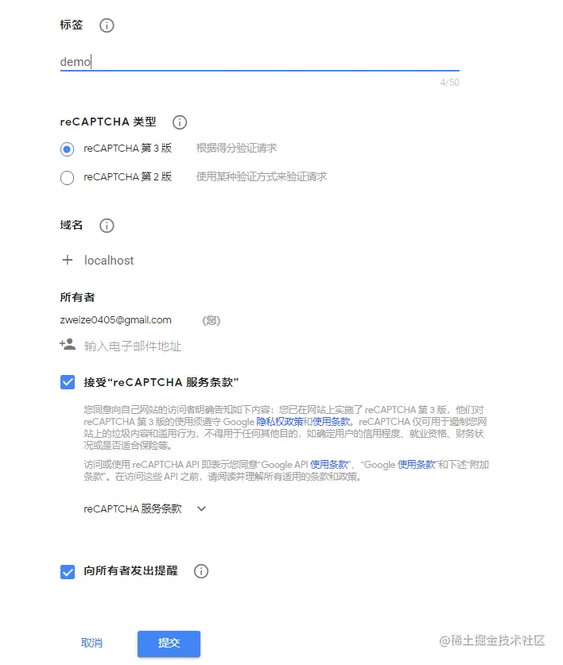
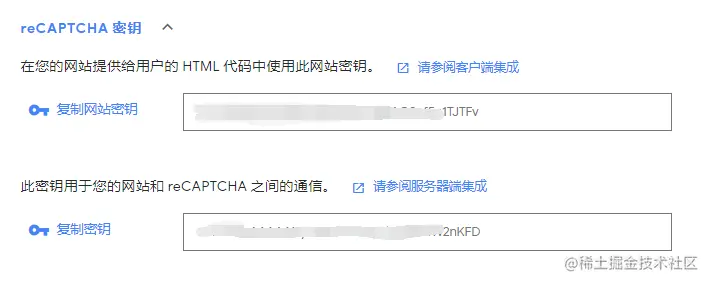
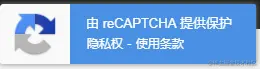

# 谷歌 google验证码 reCAPTCHA V3 对接

## 1. 官方信息

[官方文档](https://developers.google.com/recaptcha/intro)

[管理后台](https://www.google.com/recaptcha/admin#list)

## 2. 注册新网站



注册成功后，得到密钥



2个密钥，一个是在客户端使用，一个是在服务端使用

### 前端

### 官方的demo

```html
<script src="https://www.recaptcha.net/recaptcha/api.js?render=_reCAPTCHA_site_key_"></script>
<script>
  grecaptcha.ready(function () {
    grecaptcha.execute('_reCAPTCHA_site_key_', { action: 'homepage' }).then(function (token) {
      console.log(token)
    });
  });
</script>
# _reCAPTCHA_site_key_ 就是客户的的密钥
```

> 核心代码就是通过执行 grecaptcha.execute(...) 方法，在回调中获取到 token值。

v3它没有显式的一个操作，他可以在用户不知道的情况下进行验证，通过判断用户评分这些，不过评分判断要配合后端使用，如果是纯前端操作，那么会和v2一样，成功会返回一个token。

action参数为验证场景，可以自己定义名称，作用就是可以在后台，对于不同的场景进行特别的设置。例如专门为登录设计一个场景： login。

谷歌提供了4种场景，可以自行根据使用场景的不同替换参数。

* action

| 参数      | 使用场景 |
| ----------- | ----------- |
| homepage      | 一般场景，可在管理后台查看流量趋势       |
| login   | 分数较低的用户需要进行二次验证        |
| social   | 限制一些滥用的用户请求，一般用于评论        |
| e-commerce | 分数较低的用户需商品交易的时候要进行二次验证        |

### 后端的验证

请求接口 [www.google.com/recaptcha/a…](https://www.google.com/recaptcha/api/siteverify)

请求方法 POST

| 参数      | 描述 |
| ----------- | ----------- |
| secret      | 必须的，服务端的密钥       |
| response   | 必须的，客户端验证的Token        |
| remoteip   | 可选的，客户端的ip地址        |

* 响应

1、成功

```json
{
  score: 0.9  // 评分0 到 1。1：确认为人类，0：确认为机器人。
  hostname: "localhost"  // 请求的地址
  success: true  // 是否验证成功，
  challenge_ts: "2020-02-27T05:26:05Z"
  action: "homepage"
}
# 系统可以根据 score 值来判定此次请求是否合法。
```

2、失败

```json
{
  "success": true|false,
  "challenge_ts": timestamp,  // timestamp of the challenge load (ISO format yyyy-MM-dd'T'HH:mm:ssZZ)
  "hostname": string,         // the hostname of the site where the reCAPTCHA was solved
  "error-codes": [...]        // optional
}
```

* error-codes

| error-codes       |   说明      |
| ------------      | ----------- |
| missing-input-secret | 缺少输入密钥，也就是key没有|
| invalid-input-secret | secret参数无效或者不正确 |
| missing-input-response |  response参数没有，也就是token不存在 |
| invalid-input-response |  response参数无效或者不正确 |
| bad-request |  请求无效，可能是参数有误 |
| timeout-or-duplicate |  请求超时或者重复请求 |

> 国内的用户需要替换js文件的地址和服务端验证接口的地址：
1、替换客户端js地址
[www.google.com/recaptcha/a…](https://www.google.com/recaptcha/api.js) 替换为 [www.recaptcha.net/recaptcha/a…](https://www.recaptcha.net/recaptcha/api.js)
2、替换服务端接口地址
[www.google.com/recaptcha/a…](https://www.google.com/recaptcha/api/siteverify) 替换为[www.recaptcha.net/recaptcha/a…](https://www.recaptcha.net/recaptcha/api/siteverify)

## 完整案例

客户端

```html
<script src="https://recaptcha.net/recaptcha/api.js?render=_reCAPTCHA_site_key_"></script>
<script>
    grecaptcha.ready(function () {
        var act = 'downdetail';
            grecaptcha.execute('_reCAPTCHA_site_key_', {
                action: act
            }).then(function (token) {
                window.v3token = token;
                # 业务逻辑代码，须将token传递后端进行验证
            });
    });
</script>
```

服务端

```php
function checkvali($response){
    $post_data = array(
        'secret'=>'自己的密钥',
        'response'=>$response
    );
    $recaptcha_json_result = send_post('https://recaptcha.net/recaptcha/api/siteverify', $post_data);
    $recaptcha_result = json_decode($recaptcha_json_result,true);
    return $recaptcha_result;
}

function send_post($url, $post_data)
{
    $postdata = http_build_query($post_data);
    $options = array(
        'ssl' => [
            'verify_peer' => false,
            'verify_peer_name' => false,
        ],
        'http' => array(
            'method' => 'POST',
            'header' => 'Content-type:application/x-www-form-urlencoded',
            'content' => $postdata,
            'timeout' => 15 * 60 // 超时时间（单位:s）
        )
    );
    $context = stream_context_create($options);
    $result = file_get_contents($url, false, $context);
    return $result;
}
checkvali($response);
# 调用checkvali方法后，根据返回的结果再写业务逻辑
# $response 就是客户端传递过来的 token
```

## 隐藏ReCAPTCHA图标

使用 reCAPTCHA，会在网站上提示出一个图标.。



如果需要隐藏，可以添加css

```css
.grecaptcha-badge { 
  display: none; 
} 
```

## 参考 官网code

### 客户端

```html
<html>
<head>
    <script src="https://code.jquery.com/jquery-1.12.4.min.js"
            integrity="sha256-ZosEbRLbNQzLpnKIkEdrPv7lOy9C27hHQ+Xp8a4MxAQ=" crossorigin="anonymous"></script>
    <script>
        function onSubmit(token) {
            alert('thanks ' + document.getElementById('field').value);
            let res = grecaptcha.getResponse();
            console.log(res);
            $.post('/auth', {'response': res}, function (res) {
                console.log(res)
            })
        }

        function validate(event) {
            event.preventDefault();
            if (!document.getElementById('field').value) {
                alert("You must add text to the required field");
            } else {
                grecaptcha.execute();
            }
        }

        function onload() {
            var element = document.getElementById('submit');
            element.onclick = validate;
        }
    </script>
    <script src="https://www.google.com/recaptcha/api.js" async defer></script>
</head>
<body>
<form>
    Name: (required) <input id="field" name="field">
    <div id="recaptcha" class="g-recaptcha"
         data-sitekey="scekey"
         data-callback="onSubmit"
         data-size="invisible"></div>
    <button id="submit">submit</button>
</form>
<script>onload();</script>
</body>
</html>
```

### 服务端 调用上

```php
  # 调用checkvali方法后，根据返回的结果再写业务逻辑
  # $response 就是客户端传递过来的 token
  $response = input('post.response');
  $this->checkvali($response);
```
